

  

<h1 align="center">Veriqa</h1>

<em>OpenID Connect · Any stack · Open Source</em>

<strong>Sign-in and approvals through messaging apps for your website or app. No passwords, forms or SMS codes — zero typing.</strong>

  The user scans a QR code on a computer or TV screen, or presses a button on their phone, and
  confirms with a tap in a messaging channel they already trust — their own Telegram, WhatsApp
  or another supported channel. Veriqa plugs into your application as a standard OIDC provider,
  with no frontend SDK.

  <a href="https://veriqa.app/demo/flow/try-live">Try it live</a> ·
  <a href="https://veriqa.app/docs">Documentation</a> ·
  <a href="./INSTALL.md">Install</a> ·
  <a href="https://veriqa.app/contacts">Contact</a>

<!-- LEGAL-TEXT:BEGIN — legally reviewed wording: change only together with LICENSING.md and a new legal review. -->
**Open source under [MPL-2.0](./LICENSE). Free for everyone, in production, at any company size — see [LICENSING.md](./LICENSING.md).**
<!-- LEGAL-TEXT:END -->

  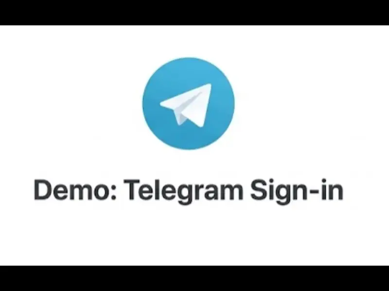 
  <a href="./docs/media/hero.mp4">Original video (mp4)</a>

## Scenarios

One familiar action covers sign-in, approvals and channel linking. Each scenario points at a
runnable sample in this repository, or — where the scenario is the same authorize request with
different parameters — at its HTTP-level recipe in the documentation.

- **Fast sign-in and registration.** Passwordless sign-in for web and desktop apps: a QR on
  screen, confirmation in a messenger. Registration happens with the same action — no form,
  no password. Samples: [`samples/dotnet/inproc/login`](./samples/dotnet/inproc/login/) (Veriqa
  inside your host) and
  [`samples/dotnet/inproc/login-client`](./samples/dotnet/inproc/login-client/) (a relying party
  that only knows OIDC); other stacks — the
  [quickstarts](https://veriqa.app/docs) for Node, Java and Python.
- **Replacing SMS codes.** The same familiar flow, but with no per-message charge — and with
  full authentication instead of code delivery. Recipe:
  [Replacing SMS codes](https://veriqa.app/docs/scenarios/sms-replacement).
- **AI agents and human-in-the-loop.** A tool call or an access grant for an AI agent is
  confirmed in the user's own messenger — a surface the agent does not control, and with an
  audit record. Samples:
  [`samples/dotnet/inproc/agent-approval`](./samples/dotnet/inproc/agent-approval/) and a
  ready plugin for Claude Code, [`samples/claude-code`](./samples/claude-code/).
- **Second factor, step-up and action approvals.** Sensitive actions — deleting important
  data, changing payment details, granting someone else access — are confirmed with a single
  tap in the user's messenger. Sample:
  [`samples/dotnet/inproc/step-up`](./samples/dotnet/inproc/step-up/), which also checks that
  the person who confirmed is the account owner.
- **Sign-in on surfaces with no keyboard.** A smart TV, a set-top box, a kiosk, a device where
  typing a password or a mailbox is punishment: the screen shows the QR and waits for the
  outcome, and the user types nothing at all. Where the surface has a browser or a webview the
  flow is the ordinary one and only the way it learns the outcome differs — live status or
  polling `GET /api/transaction/{id}/status`. Where it has none, the application's backend
  creates a confirmation and exchanges the confirmed transaction for the user's `id_token` —
  sample: [`samples/dotnet/inproc/confirmation`](./samples/dotnet/inproc/confirmation/), the
  surface-by-surface table is in
  [Sign-in surfaces](https://veriqa.app/docs/scenarios/surfaces). A device with neither a
  browser nor a backend of its own has no path yet — device flow is in progress.
- **Sign-in + messenger channel linking in one action.** The user is signed in, and your
  product gets a live channel for notifications and service scenarios. Recipe:
  [Sign-in and channel linking](https://veriqa.app/docs/scenarios/channel-linking).
- **Leads and feedback without CAPTCHA.** A visitor verifies themselves via a messenger in a
  few seconds — the site gets a verified contact instead of a "dead" address from a form.
  Recipe: [Leads and feedback without CAPTCHA](https://veriqa.app/docs/scenarios/lead-capture).
- **Starting from zero — [Get started](https://veriqa.app/docs).** Quickstarts for .NET, Node,
  Java and Python, plus the self-hosted and OS-service paths: from an empty project to a
  working sign-in, with the configuration keys spelled out.

<table align="center">
  <tr>
    <td align="center" width="50%">
      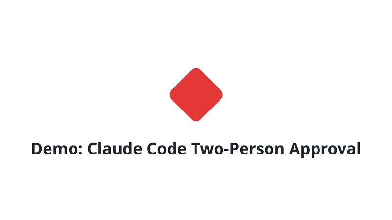 
      AI agent action approval — two approvers in turn · <a href="./docs/media/claude-code-3.mp4">mp4</a>
    </td>
    <td align="center" width="50%">
      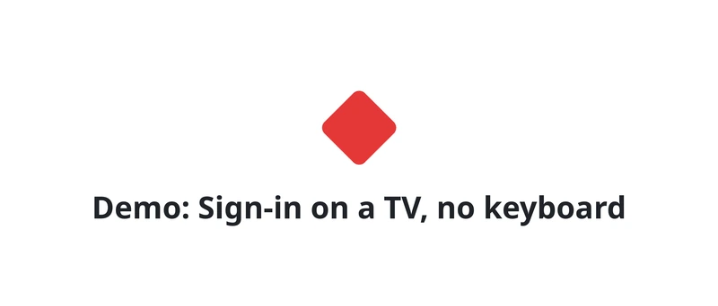 
      Sign-in on a TV — no keyboard, no typing · recorded on a real TV · <a href="./docs/media/tv-sign-in.mp4">mp4</a>
    </td>
  </tr>
</table>

### Approvals in Claude Code

A ready [Claude Code plugin](./samples/claude-code/) stops chosen agent actions until a person
approves them in a messenger — and every approval, refusal and expiry lands in the audit trail.

<table align="center">
  <tr>
    <td><a href="./docs/media/claude-code-1.webp">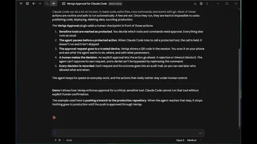</a></td>
    <td><a href="./docs/media/claude-code-2.webp">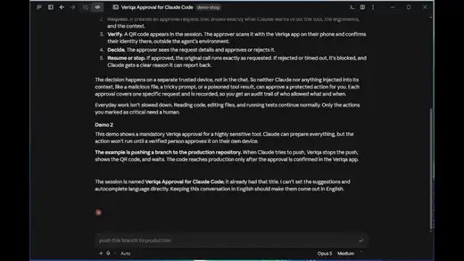</a></td>
    <td><a href="./docs/media/claude-code-3.webp">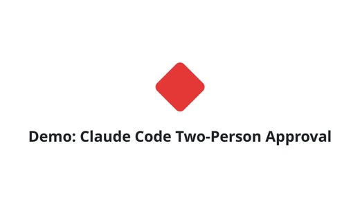</a></td>
  </tr>
  <tr>
    <td align="center">A tool call — <code>git push</code>, <code>rm -r</code> · <a href="./docs/media/claude-code-1.mp4">mp4</a></td>
    <td align="center">The start of a long command cycle · <a href="./docs/media/claude-code-2.mp4">mp4</a></td>
    <td align="center">A costly run — two approvers in turn · <a href="./docs/media/claude-code-3.mp4">mp4</a></td>
  </tr>
</table>

<strong>Sign-in and step-up on every surface</strong> — a TV, a desktop and a phone

<table align="center">
  <tr>
    <th></th>
    <th>Sign-in and registration</th>
    <th>Step-up</th>
  </tr>
  <tr>
    <th>TV recorded on a real TV</th>
    <td align="center"><a href="./docs/media/tv-sign-in.webp">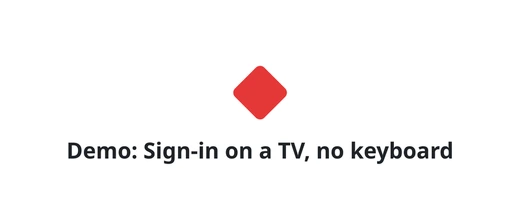</a> <a href="./docs/media/tv-sign-in.mp4">mp4</a></td>
    <td align="center"><a href="./docs/media/tv-step-up.webp">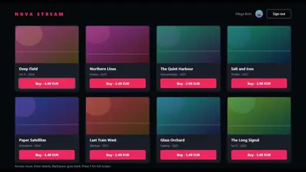</a> <a href="./docs/media/tv-step-up.mp4">mp4</a></td>
  </tr>
  <tr>
    <th>Desktop</th>
    <td align="center"><a href="./docs/media/desktop-sign-in.webp">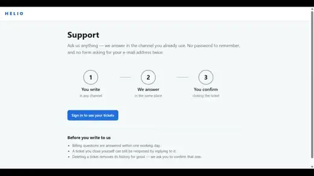</a> <a href="./docs/media/desktop-sign-in.mp4">mp4</a></td>
    <td align="center"><a href="./docs/media/desktop-step-up.webp">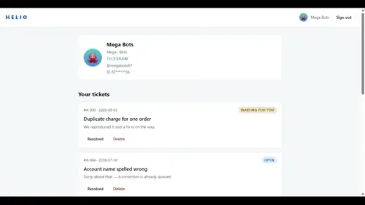</a> <a href="./docs/media/desktop-step-up.mp4">mp4</a></td>
  </tr>
  <tr>
    <th>Mobile</th>
    <td align="center"><a href="./docs/media/mobile-sign-in.webp">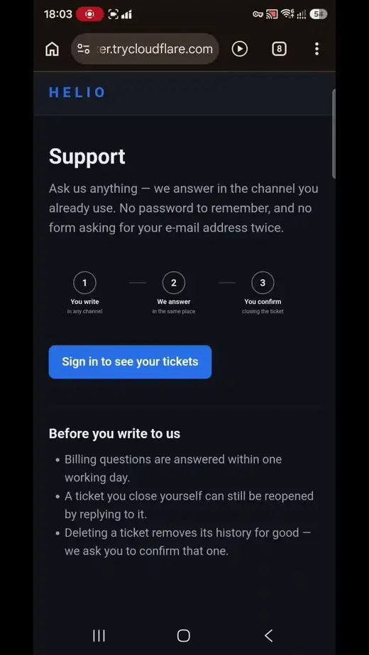</a> <a href="./docs/media/mobile-sign-in.mp4">mp4</a></td>
    <td align="center"><a href="./docs/media/mobile-step-up.webp">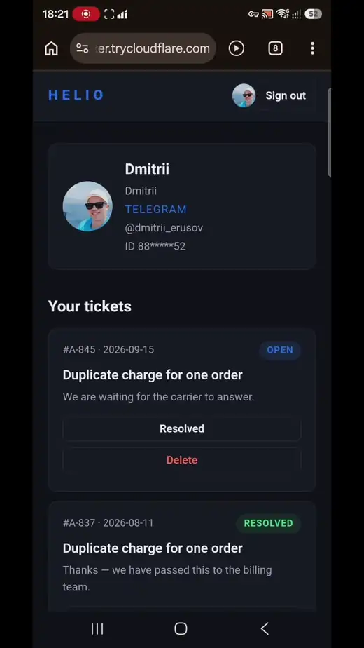</a> <a href="./docs/media/mobile-step-up.mp4">mp4</a></td>
  </tr>
</table>

## What your product gets

- **Higher sign-in conversion.** Every extra step loses people: on average 70% of online
  shopping carts are abandoned, and among shoppers who leave checkout 18% go because the site
  demanded an account and 17% because it took too long.[^baymard] 42% of people abandoned a
  purchase in the past month because they could not remember a password.[^fido-barometer]
  Instead of a password, an SMS code and screen hops — one familiar action: opening the camera
  on the phone. Sign-in or registration takes about 6 seconds in the target scenario.
- **Savings on every sign-in.** SMS is billed per message and gets more expensive year over
  year. Sign-in and approval via Veriqa aren't billed per message — at sign-in scale this shows
  up in the budget.
- **A live channel instead of a "dead" address.** Along with the sign-in, your product gets a
  connected messenger channel — for notifications, approvals and future service scenarios.
- **Configuration-only integration.** No install for the user and no new client-side code —
  Veriqa plugs into your running app through configuration.
- **Account recovery.** "Forgot password" is no longer a quest: a linked trusted channel
  becomes a reliable recovery path, without a chain of e-mails and codes.
- **Resilience to a personal-data leak.** A messenger connector usually stores the link between
  a person and the way to reach them — the most toxic column a breach can carry. Veriqa keeps
  that link out of the database entirely: a derived value instead of the native identifier, a
  different one for every integrator. Two leaked databases do not join up.

## How it works

<table align="center">
  <tr>
    <td align="center" valign="top" width="25%">
      <picture>
        <source media="(prefers-color-scheme: dark)" srcset="./docs/media/how-it-works-step-1-dark.png" />
        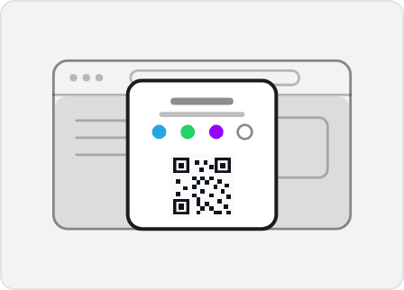
      </picture> 
      <strong>1. You put the sign-in on screen</strong> 
      A QR code appears on the page of your site or app — that's all it takes to sign in.
    </td>
    <td align="center" valign="top" width="25%">
      <picture>
        <source media="(prefers-color-scheme: dark)" srcset="./docs/media/how-it-works-step-2-dark.png" />
        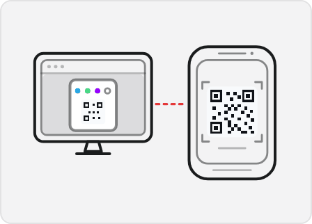
      </picture> 
      <strong>2. The user picks up their phone</strong> 
      They open the camera, scan the QR and tap the link. A familiar messenger opens — Telegram, WhatsApp or another.
    </td>
    <td align="center" valign="top" width="25%">
      <picture>
        <source media="(prefers-color-scheme: dark)" srcset="./docs/media/how-it-works-step-3-dark.png" />
        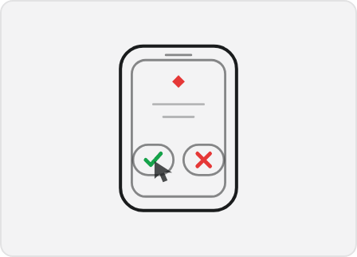
      </picture> 
      <strong>3. Confirms with one tap</strong> 
      In the messenger the user confirms the sign-in with buttons — without a password and without an SMS code.
    </td>
    <td align="center" valign="top" width="25%">
      <picture>
        <source media="(prefers-color-scheme: dark)" srcset="./docs/media/how-it-works-step-4-dark.png" />
        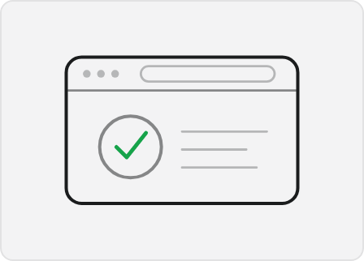
      </picture> 
      <strong>4. The user is signed in</strong> 
      Your auth system issues the tokens — the sign-in completes almost instantly.
    </td>
  </tr>
</table>

## Why not a password, SMS or passkeys

First, a comparison by what matters to the user and to the business: how many steps the first
visit takes, how long a repeat sign-in takes, and whether you are left with a way to reach the
person.

| Method | First visit | Repeat sign-in | Contact channel |
|---|---|---|---|
| Password | Form, password, confirmation e-mail | ~69 s with a second factor | E-mail, if confirmed |
| SMS code | Phone number, wait for the SMS, type the code | ~31 s\* | Phone — every message is billed |
| Social login | Button, consent screen, often a profile to complete | ~31 s\* | Usually e-mail |
| Passkey | An account by some other method first, then create the key | 3–8.5 s if the key already exists on this device; phone → PC needs Bluetooth | None |
| Veriqa | Point the camera and tap "Confirm" — the same action as at sign-in | Under 3 s | The messenger is already connected |

\* 31.2 s is the combined average for e-mail, SMS and social login, not a separate measurement
of each method.

Sign-in times: FIDO Alliance Passkey Index — 8.5 s for passkeys and 31.2 s on average for
e-mail, SMS and social login;[^passkey-index] Microsoft — 3 s for synced passkeys against 69 s
for a password with a second factor.[^microsoft] These are repeat sign-in times, when the
account and the key already exist: registration and passkey creation are not included. Veriqa —
our own measurement in the target scenario.

Compared with messenger login widgets: one integration layer for all channels and e-mail
instead of separate widgets, and full OIDC instead of a JS widget — tokens, sessions, account
linking, second factor and an audit trail.

## Under the hood

- **A sign-in is a transaction** with an explicit state, a lifetime and a single outcome. It
  survives a change of device, expires on its own, is idempotent to repeats and lands in the
  audit trail.
- **Confirmations without a sign-in.** Your backend can ask a person to approve an action — a
  payment, a device, a data transfer — straight from server to server: it creates the
  transaction, shows the QR, reads the outcome, and can check that it was the account owner who
  confirmed. The contract is the
  [server-to-server confirmation API](https://veriqa.app/docs/reference/confirmation-api).
- **Channel adapters** — Telegram, WhatsApp, other channels and Email — are switched on by
  configuration; the full list is in [Channels](https://veriqa.app/channels). A channel of your
  own needs no change to the core and does not have to be .NET: an external service in any
  language over HTTP, or the bot you already run.
- **Any stack, standard OIDC.** On .NET — a connector on top of OpenIddict, embedded in your
  host. Everywhere else — a standalone OIDC provider: Node, Java, Python, Go, PHP. In an IAM
  such as Logto it is added as an ordinary social connector.
- **All of it is configuration** — tokens, channels, the texts and branding of the sign-in
  page, policies, limits, the audit trail — with several levels of ownership and a defined
  resolution order. One installation serves many projects and bots, each with its own.
- **The audit trail follows your rules** and can be switched off entirely. Identities are
  masked and tokens are written neither to the log nor to the audit — that is how it is built,
  not a setting you have to remember. Metrics, logs and traces come the same way.
- **.NET 10, shipped as NuGet packages**, as a Docker image and as self-contained archives for
  Linux and Windows. Storage in memory, EF Core (PostgreSQL, SQL Server) or Redis. The sign-in
  page is plain JS — no frameworks, no external dependencies. The data does not leave your
  perimeter.

## Three ways to deploy

**Embedded (NuGet).** Veriqa runs inside your ASP.NET Core host as an OpenIddict connector: the
OIDC endpoints, the sign-in page, the transaction engine and the channel adapters are all in
your process. No separate service to operate.

**Standalone (Docker).** Veriqa runs as its own OIDC auth server in a container. Your
application — on any stack — talks to it over standard OpenID Connect and does not reference a
single Veriqa package: nothing enters your build or your SBOM. Sign-in through Veriqa has been
run on WordPress, Drupal, Joomla, TYPO3 and Bitrix this way, with no changes to the CMS core.

**OS service (archive).** The same standalone auth server without a container: a self-contained
executable and an installer that registers it as a systemd unit on Linux or a Windows service.
The machine needs neither Docker nor a .NET runtime.

All three are available today — see [INSTALL.md](./INSTALL.md).

## Channels

| Channel | Status |
|---|---|
| Telegram | supported |
| WhatsApp (Meta Cloud API) | supported |
| MAX | supported |
| Email (magic link and the one-tap email) | supported |
| Viber | in testing — ships in the next release |
| LINE | in testing — ships in the next release |
| Messenger | in testing — ships in the next release |
| Instagram Direct | in testing — ships in the next release |
| Slack | in testing — ships in the next release |

Four channels ship today, and five more are already in testing for the next release — 8+ channels. What else
the next release brings: [Next release](https://veriqa.app/docs/next-release).

Email works two ways. The classic **magic link** is on by default; the **one-tap email** turns the
letter around — the user sends a pre-filled one instead of receiving it, so the sign-in no longer
depends on your mail reaching their inbox, and there is no one-time link for a corporate mail
gateway to spend before the person clicks it. What each mode costs and buys:
[choosing between them](https://veriqa.app/docs/guides/channels#which-mode-to-choose).

Custom channels plug in through the MIT-licensed `Veriqa.Core.Contracts` package or as an
external service over HTTP — see `samples/dotnet/custom-channel/` and the
[channels list](https://veriqa.app/channels).

## FAQ

**Does the user need to install a separate app?**
No. The user confirms sign-in in a messenger they already have — Telegram or WhatsApp; no
separate authenticator to install.

**What if the user doesn't have Telegram or WhatsApp?**
There are several channels, plus e-mail — the user picks the one they have. The list of
supported messengers keeps growing.

**Does Veriqa replace our auth system?**
No. Veriqa stands next to it: your auth system keeps issuing tokens and owning accounts, and
Veriqa adds the trusted channel the user confirms in. For an application Veriqa is a standard
OpenID Connect provider, so the stack does not matter.

**Does Veriqa replace OpenIddict?**
No — and this question only concerns .NET. There Veriqa is a connector on top of OpenIddict,
which stays the foundation of authentication. On any other stack OpenIddict is not involved at
all: the application talks to Veriqa over plain OpenID Connect.

**How does it differ from passkeys, and is it safer?**
Passkeys are phishing-resistant by design — a higher security bar. Veriqa offers the same
convenient flow for simpler scenarios and works where cross-device passkeys break: Bluetooth
off, a VM, remote desktop.

**How much does a sign-in cost compared with an SMS code?**
Sign-in and approval via Veriqa aren't billed per message, unlike SMS — at noticeable sign-in
volume this is direct savings.

More answers in the [documentation](https://veriqa.app/docs).

## Documentation · Demo · Contact

- [Documentation](https://veriqa.app/docs) — quickstarts, concepts, configuration reference.
- [Try it live](https://veriqa.app/demo/flow/try-live) — run a real messenger sign-in in a
  minute.
- [Contact](https://veriqa.app/contacts) — questions about integration, a pilot or the roadmap.

## Contributing · Security · License

- [CONTRIBUTING.md](./CONTRIBUTING.md) — how to contribute (the CLA is accepted once, by
  email, and covers every Veriqa repository; third-party channel adapters built against the MIT
  `Veriqa.Core.Contracts` package need no CLA).
- [SECURITY.md](./SECURITY.md) — responsible disclosure. Please do not open public issues for
  vulnerabilities.
- [CODE_OF_CONDUCT.md](./CODE_OF_CONDUCT.md) — Contributor Covenant v2.1.
- [LICENSING.md](./LICENSING.md) — the license map, the licensing FAQ, and links to the
  trademark policy and the commercial terms.

[^baymard]: Baymard Institute, [Cart Abandonment Rate Statistics](https://baymard.com/lists/cart-abandonment-rate): 70.22% average documented cart abandonment across 50 studies; reasons among shoppers who abandoned a checkout, excluding those who were just browsing.
[^fido-barometer]: FIDO Alliance, [Online Authentication Barometer 2024](https://fidoalliance.org/wp-content/uploads/2024/10/Barometer-Report-Oct-31-2024-2.pdf): 10,000 consumers across ten countries; 42% abandoned a purchase and 56% gave up accessing an online service in the past month because of a forgotten password.
[^passkey-index]: FIDO Alliance, [Passkey Index](https://fidoalliance.org/fido-alliance-launches-passkey-index-revealing-significant-passkey-uptake-and-business-benefits/), October 2025.
[^microsoft]: Microsoft Learn, [Passkeys (FIDO2) authentication method in Microsoft Entra ID](https://learn.microsoft.com/en-us/entra/identity/authentication/concept-authentication-passkeys-fido2).
